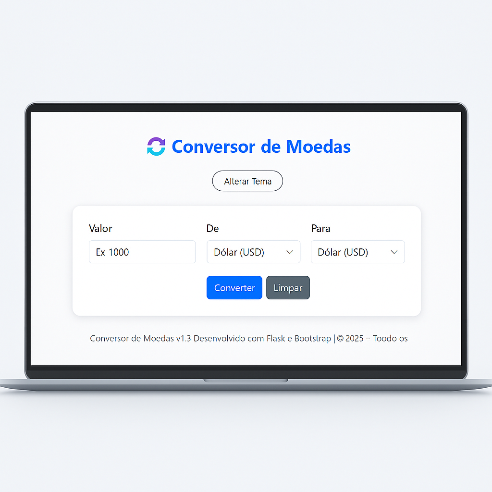

# 💱 Conversor de Moedas — Flask + CurrencyLayer

<p align="center">
  
</p>

Aplicação desenvolvida com **Flask** para conversão de moedas em tempo real utilizando a API **CurrencyLayer**.  
Interface moderna, responsiva e com alternância entre **tema claro e escuro**.

---

## 🏷️ Badges

<p>
  
  
  
  
  
</p>

---

## 📑 Índice

1. [Tecnologias Utilizadas](#-tecnologias-utilizadas)  
2. [Estrutura do Projeto](#-estrutura-do-projeto)  
3. [Como Executar o Projeto](#-como-executar-o-projeto)  
4. [Variáveis de Ambiente](#-variáveis-de-ambiente)  
5. [Preview da Aplicação](#-preview-da-aplicação)  
6. [Roadmap](#-roadmap)  
7. [Autor](#-autor)  
8. [Licença](#️-licença)

---

## 🚀 Tecnologias Utilizadas

- Python 3.13+
- Flask
- Requests
- Bootstrap 5
- HTML + Jinja2
- API CurrencyLayer
- python-dotenv

---

## 📁 Estrutura do Projeto

```
conversor_moedas/
├── app.py
├── requirements.txt
├── .gitignore
├── .env (não versionado)
├── assets/
│   └── banner-conversor.png
└── templates/
    └── index.html
```

---

## ⚙ Como Executar o Projeto

### 1️⃣ Criar o ambiente virtual

```bash
python -m venv venv
```

### 2️⃣ Ativar o ambiente virtual

**Windows**
```bash
venv\Scripts\activate
```

**Linux/macOS**
```bash
source venv/bin/activate
```

### 3️⃣ Instalar dependências

```bash
pip install -r requirements.txt
```

---

## 🔐 Variáveis de Ambiente

Crie o arquivo `.env` na raiz do projeto:

```env
API_KEY=SUA_CHAVE_DO_CURRENCYLAYER
```

Obtenha sua chave gratuita em:  
🔗 https://currencylayer.com/

---

## ▶ Preview da Aplicação

<p align="center">
  
</p>

---

## 🛠 Roadmap

- [ ] Histórico de conversões  
- [ ] Testes unitários (pytest)  
- [ ] Versão PWA  
- [ ] Suporte offline  
- [ ] Dockerfile  
- [ ] API intermediária própria  
- [ ] Deploy (Render / Railway)

---

## 👤 Autor

**Márcio Ferre Pereira**  
Desenvolvedor Backend & Full-Stack em evolução

GitHub: https://github.com/ferredev13

---

## 📝 Licença

Este projeto está sob a licença **MIT**.  
Sinta-se à vontade para usar, copiar e contribuir!

---

> Feito por Márcio Ferre  
> Se gostou, deixe uma ⭐ no repositório!  
